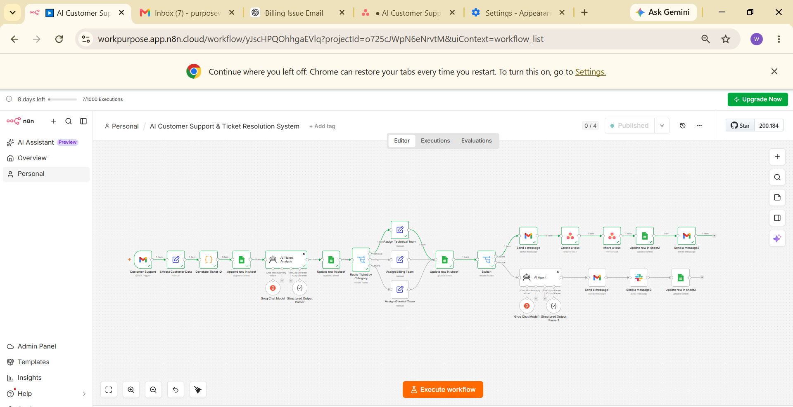

# 🤖 AI Customer Support & Ticket Resolution System

An AI-powered customer support automation system built with **n8n** that automatically receives customer support emails, extracts ticket information, analyzes customer issues using AI, categorizes and routes tickets to the appropriate team, handles urgent ticket escalation, creates tasks, sends internal notifications, and communicates with customers.

---

## 📌 About the Project

Customer support teams often spend a significant amount of time manually reviewing customer emails, creating tickets, categorizing issues, assigning tickets to the appropriate team, identifying urgent requests, notifying managers, creating tasks, and responding to customers.

This project automates the complete customer support ticket handling process using **n8n, AI, Gmail, Google Sheets, Asana, and Slack**.

The workflow starts when a customer sends a support email and continues through ticket creation, AI analysis, category-based routing, team assignment, priority handling, escalation, task management, notifications, and customer communication.

---

## 🎯 Problem Statement

Manual customer support processes can lead to:

- Time-consuming ticket creation
- Manual issue categorization
- Delays in assigning tickets to teams
- Difficulty identifying urgent issues
- Repetitive manager notifications
- Manual task creation
- Delayed customer responses
- Inconsistent ticket tracking

The goal of this project is to reduce repetitive manual work and create a structured automated process for handling customer support requests.

---

## 💡 Solution

The system automates the customer support process by:

1. Receiving customer support emails through Gmail.
2. Extracting customer and issue information.
3. Generating a unique ticket ID.
4. Storing the ticket in Google Sheets.
5. Analyzing the ticket using AI.
6. Categorizing the customer issue.
7. Routing the ticket to the appropriate team.
8. Updating the ticket information.
9. Handling urgent tickets through a dedicated escalation path.
10. Sending an email notification to the manager.
11. Creating an Asana task for urgent tickets.
12. Moving the Asana task through the workflow.
13. Sending internal Slack notifications.
14. Sending an automated response to the customer.
15. Updating the ticket record in Google Sheets.

---

## 🔄 Workflow

```text
Customer Support Email
        ↓
Extract Customer Data
        ↓
Generate Ticket ID
        ↓
Append Ticket to Google Sheets
        ↓
AI Ticket Analysis
        ↓
Update Ticket in Google Sheets
        ↓
Route Ticket by Category
        ↓
 ┌──────────────┬──────────────┬──────────────┐
 │              │              │
Technical      Billing       General
 │              │              │
 ↓              ↓              ↓
Assign Team    Assign Team    Assign Team
 │              │              │
 └──────────────┴──────────────┘
                ↓
        Update Google Sheets
                ↓
              Switch
            /       \
       Urgent       Normal
         ↓             ↓
  Manager Email    AI Response
         ↓             ↓
  Create Asana     Customer Email
      Task              ↓
         ↓         Slack Notification
    Move Task           ↓
         ↓         Update Sheet
   Update Sheet
         ↓
   Customer Email
```

---

## ✨ Key Features

### 📩 Automated Email Processing

Automatically receives incoming customer support emails through Gmail and extracts the required customer and issue information.

### 🆔 Automatic Ticket Generation

Generates a unique ticket ID for every customer support request, allowing each ticket to be tracked throughout the workflow.

### 🤖 AI Ticket Analysis

Uses an AI model to analyze the customer's support request and generate structured ticket information for further processing.

### 🏷️ Ticket Categorization

Customer issues are categorized so they can be routed to the appropriate support team.

The workflow includes categories such as:

- Technical
- Billing
- General

### 👥 Automatic Team Assignment

Tickets are automatically assigned to the appropriate team based on the detected category.

### 🚨 Urgent Ticket Escalation

Urgent tickets follow a dedicated escalation process that includes:

- Manager notification
- Asana task creation
- Task movement
- Google Sheets update
- Customer notification

### 📊 Google Sheets Ticket Tracking

Google Sheets is used to store and track ticket information throughout the workflow.

### 📌 Asana Task Management

Urgent customer support issues are automatically converted into Asana tasks so they can be tracked and managed by the responsible team.

### 💬 Slack Notifications

Slack is used to send internal notifications about relevant customer support activity.

### 📧 Automated Customer Communication

Customers receive automated email responses or updates after their support request is processed.

---

## 🛠️ Technologies Used

| Technology | Purpose |
|---|---|
| **n8n** | Workflow automation and orchestration |
| **AI / LLM** | Ticket analysis and structured output |
| **Gmail** | Customer and manager communication |
| **Google Sheets** | Ticket storage and tracking |
| **Asana** | Urgent ticket task management |
| **Slack** | Internal team notifications |
| **JavaScript** | Data processing and ticket ID generation |

---

## 📊 Workflow Components

| Component | Function |
|---|---|
| **Customer Support Email** | Receives incoming customer support requests |
| **Extract Customer Data** | Extracts customer and issue information |
| **Generate Ticket ID** | Creates a unique ticket identifier |
| **Google Sheets** | Stores and updates ticket information |
| **AI Ticket Analysis** | Analyzes and structures the support request |
| **Category Router** | Routes tickets according to their category |
| **Team Assignment** | Assigns tickets to the relevant support team |
| **Priority Handling** | Separates urgent tickets from regular tickets |
| **Manager Notification** | Notifies the manager about urgent issues |
| **Asana** | Creates and manages urgent support tasks |
| **Slack** | Sends internal support notifications |
| **Customer Email** | Sends automated customer communication |

---

## 🧠 AI Ticket Analysis

The AI component analyzes incoming customer support requests and produces structured information that is used by the workflow.

The analysis helps determine information such as:

- Issue category
- Ticket priority
- Issue summary
- Relevant ticket information
- Appropriate team routing

The structured AI output is then passed to the following workflow steps for automated processing.

---

## 🏷️ Ticket Routing

After AI analysis, the ticket is routed according to its detected category.

```text
AI Ticket Analysis
        ↓
Category Detection
        ↓
 ┌─────────────┬─────────────┬─────────────┐
 │             │             │
Technical     Billing      General
 │             │             │
 ↓             ↓             ↓
Technical     Billing      General
 Team          Team          Team
```

This reduces the need for manual ticket sorting and team assignment.

---

## 🚨 Urgent Ticket Escalation

When a ticket requires urgent attention, it follows a separate escalation path.

```text
Urgent Ticket
      ↓
Manager Notification
      ↓
Create Asana Task
      ↓
Move Asana Task
      ↓
Update Google Sheets
      ↓
Customer Notification
```

This ensures that urgent customer issues are escalated and tracked properly.

---

## 📋 Ticket Tracking

Google Sheets is used as the central ticket tracking system.

Example ticket information includes:

```text
Ticket ID
Customer Name
Customer Email
Issue
Category
Priority
Assigned Team
Status
```

The ticket record is updated as the request moves through different stages of the workflow.

---

## 💬 Internal Notifications

Slack is used for internal communication and keeps the support team informed about relevant ticket activity.

For urgent issues, the manager is also notified through email so that escalation can happen immediately.

---

## 📧 Customer Communication

The workflow automatically communicates with the customer after processing their support request.

This reduces the need for support staff to manually send routine updates and helps maintain timely communication.

---

## 📸 Screenshots

### 🔄 Complete n8n Workflow



The complete n8n automation showing customer email processing, ticket generation, AI analysis, category routing, team assignment, escalation, task management, and notifications.

---

### 📊 Google Sheets — Ticket Tracking


Google Sheets is used to store and update customer support ticket information throughout the workflow.

---

### 📌 Asana — Urgent Ticket Task


Urgent customer support issues are automatically converted into Asana tasks for tracking and management.

---

### 💬 Slack — Internal Notification


Slack is used to notify the internal support team about customer support activity.

---

### 📧 Manager Notification


The manager receives an automated email when an urgent customer support issue requires escalation.

---

### 📩 Customer Email


The customer receives an automated response or update after the support request is processed.

---

## 📁 Project Structure

```text
AI-Customer-Support-Ticket-Resolution/
│
├── README.md
│
├── workflow/
│   └── AI_Customer_Support_Ticket_Resolution.json
│
└── screenshots/
    ├── workflow.png
    ├── google-sheets.png
    ├── slack-notification.png
    ├── asana-task.png
    ├── manager-email.png
    └── customer-email.png
```

---

## ⚙️ Setup

### 1. Import the Workflow

Import the workflow JSON file into your n8n instance.

```text
workflow/AI_Customer_Support_Ticket_Resolution.json
```

### 2. Configure Credentials

Connect the required credentials for:

- Gmail
- Google Sheets
- Asana
- Slack
- AI model

### 3. Configure Google Sheets

Create a Google Sheet for ticket tracking.

Example columns:

```text
Ticket ID
Customer Name
Customer Email
Issue
Category
Priority
Assigned Team
Status
```

### 4. Configure Gmail

Configure Gmail for:

- Receiving customer support emails
- Sending manager notifications
- Sending customer responses

### 5. Configure Asana

Connect Asana and select the project where urgent support tasks should be created.

### 6. Configure Slack

Connect Slack and select the channel used for internal support notifications.

### 7. Test the Workflow

Send sample customer support emails and verify:

- Customer data extraction
- Ticket ID generation
- Google Sheets entry
- AI ticket analysis
- Category detection
- Team assignment
- Priority handling
- Manager notification
- Asana task creation
- Slack notification
- Customer email
- Google Sheets updates

---

## 📈 Benefits

This automation helps customer support teams by:

- Reducing repetitive manual work
- Automating ticket creation
- Improving ticket organization
- Automating issue categorization
- Speeding up team assignment
- Identifying urgent issues
- Improving internal communication
- Maintaining centralized ticket records
- Automating customer communication
- Improving ticket tracking

---

## 🔮 Future Improvements

Possible future improvements include:

- SLA monitoring
- Automatic follow-up reminders
- Customer satisfaction analysis
- Support analytics dashboard
- Knowledge-base integration
- Advanced ticket history
- Human approval for sensitive customer responses
- Automated resolution tracking

---

## 🎯 Use Case

This system can be used by organizations that receive customer support requests through email and want to automate the complete ticket handling process:

```text
Customer Request
       ↓
Ticket Creation
       ↓
AI Analysis
       ↓
Categorization
       ↓
Team Assignment
       ↓
Priority Handling
       ↓
Escalation
       ↓
Task Management
       ↓
Customer Communication
       ↓
Ticket Tracking
```

---

## 🔐 Security Note

The workflow JSON included in this repository does not contain sensitive credentials.

Before sharing the workflow publicly, make sure that:

- API keys are not included
- OAuth tokens are not included
- Passwords are not included
- Private customer information is removed
- Personal email addresses are removed from screenshots or test data

Credentials should be configured separately inside n8n.

---

## 👩‍💻 Project Information

**Project:** AI Customer Support & Ticket Resolution System

**Project Type:** AI Automation / Workflow Automation

**Built With:** n8n, AI, Gmail, Google Sheets, Asana, Slack

---

## ⭐ Key Takeaway

This project demonstrates how **AI and workflow automation can be combined with business applications** to create an end-to-end customer support ticket resolution system.

It automates the process from **customer request → ticket creation → AI analysis → categorization → team assignment → urgent escalation → task management → notifications → customer communication**.

